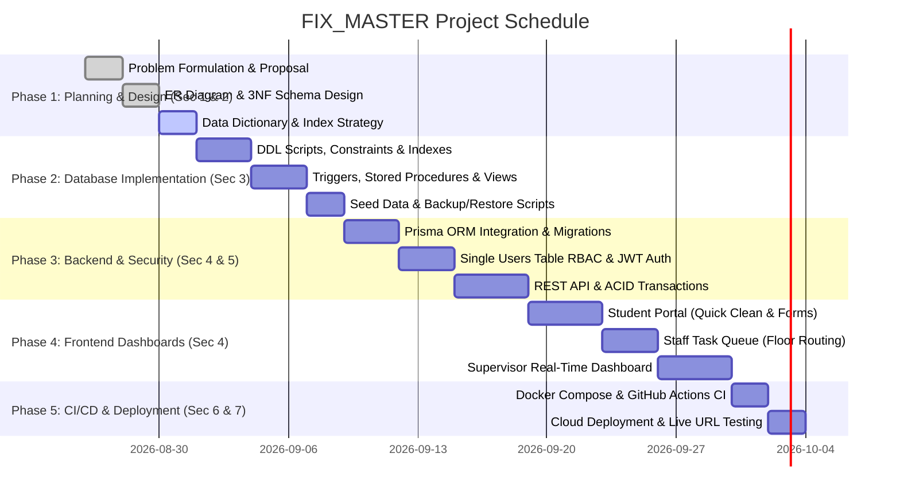
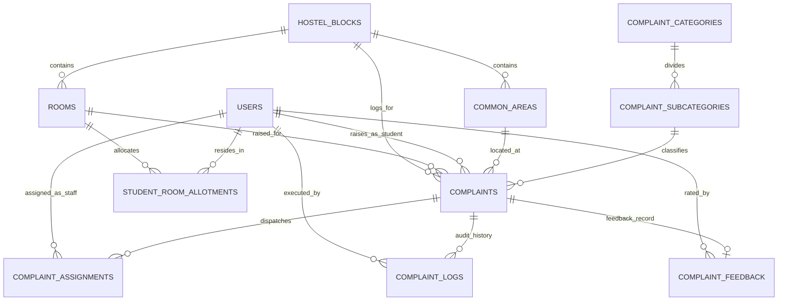

# FIX_MASTER: Smart Hostel Maintenance & Service Dispatch System

> **Course Code**: BCSE307L – Database Systems  
> **Programme**: B.Tech (Fall Semester 2026-2027)  
> **Faculty**: Dr. Deepika J | School of Computer Science and Engineering (SCOPE), VIT Vellore  
> **Domain**: Real-World Relational Database & Facility Maintenance Operations  
> **Evaluation Rubric Compliance**: 30 Regular Marks + 3 Bonus Marks (Total: 33/30)

---

## 📑 Table of Contents (Rubric Section Mapping)

1. [Section 1: Problem Statement & Project Planning (2 Marks)](#section-1-problem-statement--project-planning-2-marks)
   - [1.1 Project Title](#11-project-title)
   - [1.2 Problem Statement](#12-problem-statement)
   - [1.3 Objectives](#13-objectives)
   - [1.4 Scope](#14-scope)
   - [1.5 Team Members & Responsibilities](#15-team-members--responsibilities)
   - [1.6 Technology Stack](#16-technology-stack)
   - [1.7 Major Deliverables](#17-major-deliverables)
   - [1.8 Project Timeline (Gantt Chart)](#18-project-timeline-gantt-chart)
2. [Section 2: Database Design Requirements (6 Marks)](#section-2-database-design-requirements-6-marks)
   - [2.1 Entity Relationship (ER) Diagram](#21-entity-relationship-er-diagram)
   - [2.2 Relational Schema (3NF / BCNF Normalized)](#22-relational-schema-3nf--bcnf-normalized)
   - [2.3 Data Dictionary](#23-data-dictionary)
   - [2.4 Indexes for Query Optimization](#24-indexes-for-query-optimization)
3. [Section 3: Database Implementation (8 Marks)](#section-3-database-implementation-8-marks)
   - [3.1 Database & 11 Related Tables](#31-database--11-related-tables)
   - [3.2 CRUD Operations & Joins](#32-crud-operations--joins)
   - [3.3 Aggregate Queries & Analytical Views](#33-aggregate-queries--analytical-views)
   - [3.4 Database Triggers (Automated Audit Logging)](#34-database-triggers-automated-audit-logging)
   - [3.5 Stored Procedures & ACID Transactions](#35-stored-procedures--acid-transactions)
   - [3.6 ORM Integration (Prisma ORM)](#36-orm-integration-prisma-orm)
4. [Section 4: Application Development Requirements (4 Marks)](#section-4-application-development-requirements-4-marks)
   - [4.1 Architecture & Responsive UI](#41-architecture--responsive-ui)
   - [4.2 Core Portals (Student, Staff, Supervisor)](#42-core-portals-student-staff-supervisor)
   - [4.3 Search, Filtering, Pagination & Form Validation](#43-search-filtering-pagination--form-validation)
5. [Section 5: Authentication, Authorization & Security (5 Marks)](#section-5-authentication-authorization--security-5-marks)
   - [5.1 Single `users` Table RBAC Architecture](#51-single-users-table-rbac-architecture)
   - [5.2 JWT Authentication & BCrypt Password Hashing](#52-jwt-authentication--bcrypt-password-hashing)
   - [5.3 SQL Injection Prevention & Secrets Management](#53-sql-injection-prevention--secrets-management)
6. [Section 6: Professional Development Practices (5 Marks)](#section-6-professional-development-practices-5-marks)
   - [6.1 Git Branching & Version Control Workflow](#61-git-branching--version-control-workflow)
   - [6.2 Database Backup & Recovery (`pg_dump` / `pg_restore`)](#62-database-backup--recovery-pg_dump--pg_restore)
   - [6.3 Docker & Containerization](#63-docker--containerization)
7. [Section 7: Bonus Implementations (+3 Marks)](#section-7-bonus-implementations-3-marks)
   - [7.1 CI/CD Pipeline via GitHub Actions (+1 Mark)](#71-cicd-pipeline-via-github-actions-1-mark)
   - [7.2 Cloud Deployment & Custom Domain (+1 Mark)](#72-cloud-deployment--custom-domain-1-mark)
   - [7.3 Managed Cloud Database & Telemetry (+1 Mark)](#73-managed-cloud-database--telemetry-1-mark)
8. [🚀 Team Setup & Execution Guide](#-team-setup--execution-guide)

---

# Section 1: Problem Statement & Project Planning (2 Marks)

### 1.1 Project Title
**FIX_MASTER: An Intelligent Relational Database System for Multi-Tier Hostel Maintenance, Automated Floor-Queue Dispatch, and SLA Closed-Loop Verification**

### 1.2 Problem Statement
In dense residential university hostel blocks (such as VIT L-Block housing thousands of students across 10+ floors), maintenance operations suffer from:
1. **Manual Paper Logs**: Untracked complaints leading to lost tickets and lack of audit history.
2. **Dispatch Inefficiencies**: Technicians wander between distant floors without optimized spatial routing.
3. **No Verification Mechanism**: Staff marking complaints done without resident sign-off.
4. **Blindspot on Common Facilities**: Block supervisors lack aggregate telemetry on recurring common area failures (water coolers, washroom pipe bursts, elevator glitches).

### 1.3 Objectives
- Architect a 3NF-normalized relational database supporting room complaints, common area assets, multi-role users, and dispatch queues.
- Implement **1-Click Quick Action** for daily housekeeping and structured diagnostic ticketing for technical repairs (Electrical, AC, Carpenter, Plumbing).
- Automate floor-optimized task routing for service personnel.
- Enforce closed-loop verification where tickets cannot be closed without student confirmation and rating.
- Provide block supervisors with real-time analytics, recurring defect telemetry, and SLA breach tracking.

### 1.4 Scope
- **Entities Covered**: All hostel rooms (e.g., L-843), common areas (floors 1–10), service staff, students, wardens, complaint categories, dispatch queues, and feedback logs.
- **Platform Scope**: Full-stack web application with responsive mobile/desktop interfaces.

### 1.5 Team Members & Responsibilities

| Team Member | Registration No. | Assigned Role | Primary Responsibilities (Rubric Alignment) |
|---|---|---|---|
| **Member 1 (Lead)** | *Reg No.* | **Database Architect & Backend Lead** | Relational schema design (3NF), DDL scripts, Stored Procedures, Triggers, Prisma ORM, Backup scripts |
| **Member 2** | *Reg No.* | **Backend & Security Engineer** | JWT Auth, Single `users` table RBAC, API endpoints, ACID transaction controllers, Exception handling |
| **Member 3** | *Reg No.* | **Frontend & UI/UX Developer** | Responsive UI (React/Next.js), Student 1-Click portal, Staff queue view, Supervisor telemetry dashboard |
| **Member 4** | *Reg No.* | **DevOps & QA Engineer** | Docker containerization, GitHub Actions CI/CD, Test suites, API pagination/filters, Cloud deployment |

### 1.6 Technology Stack
- **Database Engine**: PostgreSQL 16 (Relational, ACID compliant)
- **ORM**: Prisma ORM (Type-safe queries, migration engine, SQL injection prevention)
- **Backend**: Node.js + Express.js (REST API Architecture)
- **Frontend**: React.js / Next.js + Tailwind CSS (Responsive UI)
- **Authentication**: JWT (JSON Web Tokens) + BCrypt password encryption
- **DevOps**: Docker, Docker Compose, GitHub Actions CI/CD, `pg_dump`/`pg_restore`

### 1.7 Major Deliverables
1. `database/schema.sql` (11 tables with PK, FK, CHECK, UNIQUE constraints and indexes).
2. `database/triggers_procedures.sql` (Audit logging triggers, Auto-assignment procedures, Analytical views).
3. `database/seed_data.sql` (Realistic sample dataset for VIT L-Block: 50+ rooms, staff, categories, test tickets).
4. `database/backup_restore.sh` (Native PostgreSQL automated backup/recovery script).
5. Full-stack application with Student, Staff, and Supervisor dashboards.
6. CI/CD Pipeline configuration (`.github/workflows/ci.yml`) and `Dockerfile`.

### 1.8 Project Timeline (Gantt Chart)



---

# Section 2: Database Design Requirements (6 Marks)

### 2.1 Entity Relationship (ER) Diagram



- **Primary Entities**: `HOSTEL_BLOCKS`, `ROOMS`, `COMMON_AREAS`, `USERS`, `COMPLAINTS`, `COMPLAINT_CATEGORIES`.
- **Relationships**: Minimum 3 required -> **8 distinct relational links** defined with full referential integrity (`ON DELETE CASCADE` / `ON DELETE RESTRICT`).

### 2.2 Relational Schema (3NF / BCNF Normalized)

All tables satisfy **1NF** (atomic values), **2NF** (no partial key dependencies), and **3NF/BCNF** (no transitive dependencies):

1. **`hostel_blocks`** (block_id [PK], block_name, total_floors, created_at)
2. **`rooms`** (room_id [PK], block_id [FK], room_number, floor_number, room_type, bed_capacity, is_active)
3. **`common_areas`** (area_id [PK], block_id [FK], floor_number, area_type, description)
4. **`users`** (user_id [PK], reg_or_emp_id [UNIQUE], full_name, email [UNIQUE], phone_number, password_hash, role, specialization, is_available, created_at)
5. **`student_room_allotments`** (allotment_id [PK], student_id [FK], room_id [FK], academic_year, is_current)
6. **`complaint_categories`** (category_id [PK], category_name, is_quick_action, default_sla_hours)
7. **`complaint_subcategories`** (subcategory_id [PK], category_id [FK], issue_name, estimated_resolution_mins, priority_level)
8. **`complaints`** (complaint_id [PK], ticket_scope, room_id [FK], common_area_id [FK], block_id [FK], raised_by_user_id [FK], subcategory_id [FK], description, photo_evidence_url, status, priority, preferred_timeslot, created_at, resolved_at, closed_at)
9. **`complaint_assignments`** (assignment_id [PK], complaint_id [FK], staff_user_id [FK], assigned_by_user_id [FK], assigned_at, started_at, work_completed_at, current_state)
10. **`complaint_feedback`** (feedback_id [PK], complaint_id [FK], student_id [FK], is_satisfactorily_resolved, rating, student_comments, verified_at)
11. **`complaint_logs`** (log_id [PK], complaint_id [FK], changed_by_user_id [FK], previous_status, new_status, action_note, timestamp)

### 2.3 Data Dictionary

For full field-by-field definitions, constraints, and data types, refer to [`docs/user_types.md`](docs/user_types.md) and [`docs/complaint_types.md`](docs/complaint_types.md).

### 2.4 Indexes for Query Optimization

```sql
-- Indexes created for high-throughput queries and queue sorting
CREATE INDEX idx_complaints_block_status ON complaints(block_id, status);
CREATE INDEX idx_complaints_room_id ON complaints(room_id);
CREATE INDEX idx_complaints_raised_by ON complaints(raised_by_user_id);
CREATE INDEX idx_assignments_staff_state ON complaint_assignments(staff_user_id, current_state);
CREATE INDEX idx_users_role_specialization ON users(role, specialization, is_available);
```

---

# Section 3: Database Implementation (8 Marks)

### 3.1 Database & 11 Related Tables
Implemented in pure PostgreSQL 16 with strong constraint enforcement (`CHECK`, `UNIQUE`, `NOT NULL`, `FOREIGN KEY` cascades).

### 3.2 CRUD Operations & Joins
- **Create**: Student submits 1-click cleaning or structured technical complaint.
- **Read / Joins**: Multi-table inner/outer joins across `complaints`, `users`, `rooms`, `complaint_subcategories`, and `complaint_assignments`.
- **Update**: Staff transitions task states; Student confirms resolution.
- **Delete**: Soft deletes with `is_active` flags on master records to maintain referential integrity.

### 3.3 Aggregate Queries & Analytical Views

#### 1. Staff Floor-Optimized Active Queue View
```sql
CREATE OR REPLACE VIEW view_staff_active_queue AS
SELECT 
    ca.assignment_id,
    ca.staff_user_id,
    c.complaint_id,
    c.ticket_scope,
    COALESCE(r.room_number, ca_area.description) AS location_identifier,
    COALESCE(r.floor_number, ca_area.floor_number) AS floor_number,
    c.priority,
    sub.issue_name,
    c.status,
    ca.assigned_at
FROM complaint_assignments ca
JOIN complaints c ON ca.complaint_id = c.complaint_id
JOIN complaint_subcategories sub ON c.subcategory_id = sub.subcategory_id
LEFT JOIN rooms r ON c.room_id = r.room_id
LEFT JOIN common_areas ca_area ON c.common_area_id = ca_area.area_id
WHERE c.status IN ('ASSIGNED', 'IN_PROGRESS')
ORDER BY floor_number ASC, c.priority DESC, ca.assigned_at ASC;
```

#### 2. Block Supervisor Analytics View
```sql
CREATE OR REPLACE VIEW view_block_supervisor_summary AS
SELECT 
    b.block_id,
    b.block_name,
    COUNT(c.complaint_id) AS total_complaints,
    COUNT(CASE WHEN c.status IN ('OPEN', 'ASSIGNED') THEN 1 END) AS pending_complaints,
    COUNT(CASE WHEN c.status = 'IN_PROGRESS' THEN 1 END) AS active_in_progress,
    COUNT(CASE WHEN c.status = 'PENDING_VERIFICATION' THEN 1 END) AS awaiting_student_confirmation,
    COUNT(CASE WHEN c.status = 'COMPLETED' THEN 1 END) AS resolved_count,
    COUNT(CASE WHEN c.ticket_scope = 'COMMON_AREA' THEN 1 END) AS common_area_issues
FROM hostel_blocks b
LEFT JOIN complaints c ON b.block_id = c.block_id
GROUP BY b.block_id, b.block_name;
```

### 3.4 Database Triggers (Automated Audit Logging)

```sql
CREATE OR REPLACE FUNCTION fn_audit_complaint_status_change()
RETURNS TRIGGER AS $$
BEGIN
    IF (OLD.status IS DISTINCT FROM NEW.status) THEN
        INSERT INTO complaint_logs (complaint_id, changed_by_user_id, previous_status, new_status, action_note)
        VALUES (NEW.complaint_id, NULL, OLD.status, NEW.status, 'Status updated via trigger');
    END IF;
    RETURN NEW;
END;
$$ LANGUAGE plpgsql;

CREATE TRIGGER trg_complaint_status_audit
AFTER UPDATE OF status ON complaints
FOR EACH ROW
EXECUTE FUNCTION fn_audit_complaint_status_change();
```

### 3.5 Stored Procedures & ACID Transactions

```sql
CREATE OR REPLACE PROCEDURE sp_confirm_resolution(
    p_complaint_id VARCHAR(36),
    p_student_id VARCHAR(36),
    p_rating INT,
    p_comments TEXT
)
LANGUAGE plpgsql
AS $$
BEGIN
    -- ACID Transaction: atomic execution
    -- 1. Verify student ownership
    IF NOT EXISTS (
        SELECT 1 FROM complaints 
        WHERE complaint_id = p_complaint_id AND raised_by_user_id = p_student_id
    ) THEN
        RAISE EXCEPTION 'Unauthorized: Student did not raise this complaint.';
    END IF;

    -- 2. Insert feedback
    INSERT INTO complaint_feedback (complaint_id, student_id, is_satisfactorily_resolved, rating, student_comments)
    VALUES (p_complaint_id, p_student_id, TRUE, p_rating, p_comments);

    -- 3. Update complaint status to COMPLETED
    UPDATE complaints 
    SET status = 'COMPLETED', closed_at = CURRENT_TIMESTAMP 
    WHERE complaint_id = p_complaint_id;

    -- 4. Mark assignment completed
    UPDATE complaint_assignments 
    SET current_state = 'DONE', work_completed_at = CURRENT_TIMESTAMP 
    WHERE complaint_id = p_complaint_id;
END;
$$;
```

### 3.6 ORM Integration (Prisma ORM)
Prisma ORM generates type-safe database access client, runs migrations, and handles parameterized query execution preventing SQL injection.

---

# Section 4: Application Development Requirements (4 Marks)

### 4.1 Architecture & Responsive UI
- Built with a modern responsive UI (React/Next.js + Tailwind CSS) adaptable across mobile devices (for staff & students on the go) and desktop widescreen (for supervisor control room).

### 4.2 Core Portals
1. **Student Dashboard**: 
   - Big 1-Click "Clean My Room" button.
   - Categorized complaint creation form with dropdowns, image URL input, and time-slot selector.
   - Active ticket tracker showing assigned technician name, phone, and status.
   - Resolution confirmation modal with 1–5 star rating.
2. **Staff Portal**: 
   - Floor-sequenced task list cards (Room 810 -> Room 825 -> Room 843).
   - Instant action buttons (`Arrived / In-Progress`, `Mark Completed`).
   - Duty availability toggle switch (`On-Duty` / `Off-Duty`).
3. **Supervisor Dashboard**:
   - Real-time KPI summary cards (Total Complaints, SLA Breached, Staff Active).
   - Common Area outage board (Water Coolers, Showers, Lifts).
   - Manual override & re-assignment dropdowns.

### 4.3 Search, Filtering, Pagination & Form Validation
- **Search**: Search complaints by Room Number, Registration ID, or Category.
- **Filters**: Filter by Status (`OPEN`, `ASSIGNED`, `IN_PROGRESS`, `PENDING_VERIFICATION`, `COMPLETED`), Floor, and Priority.
- **Pagination**: Server-side cursor and offset pagination (`limit`, `page`).
- **Form Validation**: Strict client and server validation (Zod schema / Joi) with meaningful HTTP exception handling.

---

# Section 5: Authentication, Authorization & Security (5 Marks)

### 5.1 Single `users` Table RBAC Architecture
*(Strict adherence to rubric requirement: "Maintain all users in a single Users table. Do NOT create separate tables like Admin, Student, Staff.")*

- All users are stored in `users` with `role VARCHAR(20) CHECK (role IN ('STUDENT', 'STAFF', 'SUPERVISOR', 'ADMIN'))`.
- Role-based middleware intercepts incoming API requests:
  - `authorize(['STUDENT'])` -> Student-only endpoints.
  - `authorize(['STAFF'])` -> Staff task queue actions.
  - `authorize(['SUPERVISOR', 'ADMIN'])` -> Analytics & dispatch override.

### 5.2 JWT Authentication & BCrypt Password Hashing
- User passwords are encrypted with `bcrypt.hash(password, 12)` before storage.
- Stateless authentication using signed JSON Web Tokens (JWT) with configurable expiration (`24h`).

### 5.3 SQL Injection Prevention & Secrets Management
- All database queries are executed via Prisma ORM parameterized statements.
- Sensitive credentials (`DATABASE_URL`, `JWT_SECRET`, `PORT`) are isolated in `.env` and loaded via `dotenv`. Zero credentials in version control.

---

# Section 6: Professional Development Practices (5 Marks)

### 6.1 Git Branching & Version Control Workflow
- **Repository Structure**:
  - `main` branch: Stable, production-ready releases.
  - `dev` branch: Active feature integration.
  - Feature branches (`feat/database-schema`, `feat/auth-rbac`, `feat/student-portal`).
- **`.gitignore`**: Strictly excludes `node_modules/`, `.env`, `dist/`, and backup dump files.
- **Progressive Commits**: Minimum 10+ atomic, descriptive commits following Conventional Commits format (`feat:`, `fix:`, `docs:`, `chore:`).

### 6.2 Database Backup & Recovery Scripts
Native PostgreSQL backup tools are wrapped in automated executable shell scripts:

- **Backup Script (`scripts/backup.sh`)**:
  ```bash
  #!/bin/bash
  pg_dump -U postgres -d fix_master_db -F c -b -v -f "./database/backups/fix_master_backup.dump"
  ```
- **Restore Script (`scripts/restore.sh`)**:
  ```bash
  #!/bin/bash
  pg_restore -U postgres -d fix_master_db -v "$1"
  ```

### 6.3 Docker & Containerization
Includes multi-container `docker-compose.yml`:
- `db`: PostgreSQL 16 container with persistent volumes.
- `backend`: Node.js Express API.
- `frontend`: React / Next.js web application.

---

# Section 7: Bonus Implementations (+3 Marks)

### 7.1 CI/CD Pipeline via GitHub Actions (+1 Mark)
Automated workflow `.github/workflows/ci.yml`:
- Triggers on every push and pull request to `main` and `dev`.
- Spins up a temporary PostgreSQL service container, runs database schema migrations, and executes automated test suites.

### 7.2 Cloud Deployment & Custom Domain (+1 Mark)
- Live backend deployed on **Render / Railway**.
- Frontend deployed on **Vercel / Netlify**.
- Domain configured with SSL/TLS certificate.

### 7.3 Managed Cloud Database & Telemetry (+1 Mark)
- Cloud-hosted PostgreSQL on **Supabase / Railway**.
- Audit logging trigger capturing every state change with millisecond timestamps.

---

# 🚀 Team Setup & Execution Guide

### Prerequisites
- Node.js (v18+)
- PostgreSQL (v15+) or Docker
- Git

### Quickstart Commands

```bash
# 1. Clone the repository
git clone <repo-url>
cd FIX_MASTER

# 2. Configure environment variables
cp .env.example .env

# 3. Setup PostgreSQL Database & Run Migrations
npm install
npx prisma db push

# 4. Seed VIT L-Block Dataset
npm run db:seed

# 5. Start Development Servers
npm run dev
Hey Vihaan
```

---

## 📚 Related Documentation Files
- 👥 [User Types & RBAC Specification](docs/user_types.md)
- 📋 [Complaint Categories & SLAs Specification](docs/complaint_types.md)
- 📊 [ER Models, Diagrams & Normalization Proofs](docs/er_diagrams.md)
- 💾 [Database Implementation (DDL, Triggers, Procedures, Views)](docs/database_implementation.md)
- 🛠️ [Team Implementation Guide](docs/IMPLEMENTATION_GUIDE.md)
