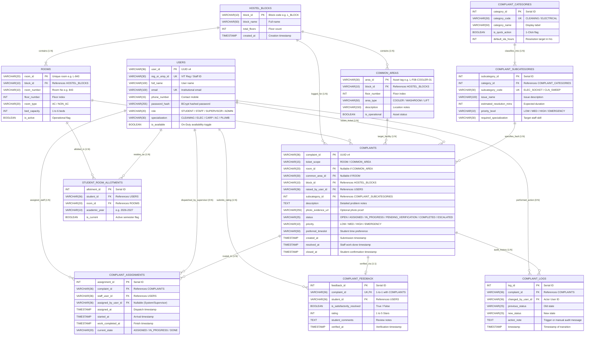
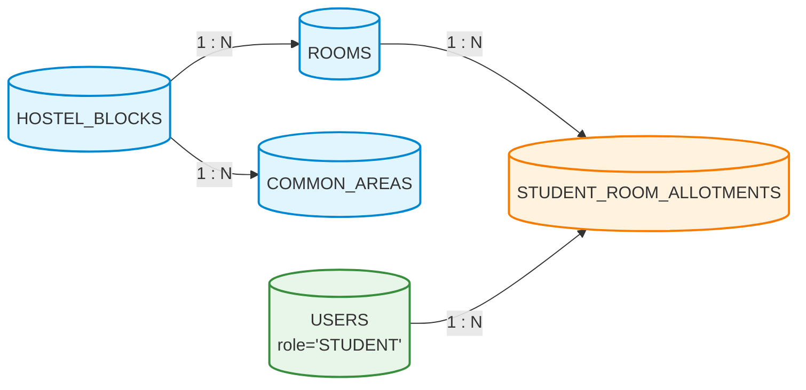
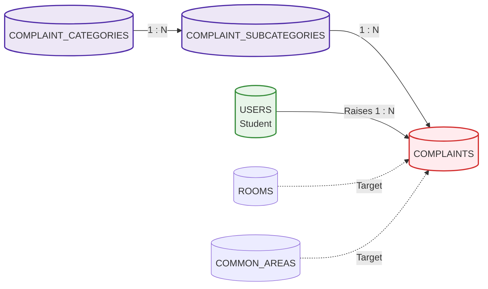
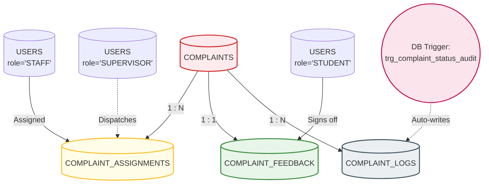

# FIX_MASTER — Entity-Relationship (ER) Models & Diagrammatic Specification

> **Course Code**: BCSE307L – Database Systems  
> **Topic**: Conceptual, Logical, and Physical ER Modeling & Normalization Proofs (Section 2: 6 Marks)  
> **Notation Styles**: Crow's Foot Notation, Chen's ER Model, Relational Schema Dependency Graph  

---

## 1. Complete System Conceptual ER Diagram (Crow's Foot Notation)

This diagram visualizes all 11 core entities, their primary/foreign key attributes, and precise relational cardinalities:

---

## 2. Modular Sub-System ER Diagrams

To assist presentation in viva voce examinations and lab evaluations, the system is decomposed into three focused sub-models:

### 2.1 Sub-System 1: Infrastructure, Space & Student Resident Allocation
Focuses on spatial hierarchy and room allottees.

### 2.2 Sub-System 2: Domain Taxonomy & Complaint Classification
Focuses on the categorization engine and SLA policy mapping.

### 2.3 Sub-System 3: Staff Task Dispatch, Closed-Loop Verification & Audit Trail
Focuses on the operational workflow, staff assignment, student confirmation, and automated trigger logging.

---

## 3. Entity Relationships, Cardinalities & Deletion Rules Matrix

| Parent Entity ($E_1$) | Child Entity ($E_2$) | Cardinality ($E_1 \rightarrow E_2$) | Foreign Key Attribute in $E_2$ | Referential Integrity (`ON DELETE`) | Business Justification |
|---|---|:---:|---|---|---|
| `hostel_blocks` | `rooms` | $1 : N$ (Mandatory) | `rooms.block_id` | `CASCADE` | If a block is deleted, its room structure ceases to exist. |
| `hostel_blocks` | `common_areas` | $1 : N$ (Optional) | `common_areas.block_id` | `CASCADE` | If a block is removed, its common areas are removed. |
| `rooms` | `student_room_allotments`| $1 : N$ (Optional) | `student_room_allotments.room_id` | `RESTRICT` | Cannot delete a room while a student is actively alloted to it. |
| `users` | `student_room_allotments`| $1 : N$ (Mandatory) | `student_room_allotments.student_id` | `CASCADE` | If a student profile is purged, allotments are cleaned. |
| `complaint_categories` | `complaint_subcategories` | $1 : N$ (Mandatory) | `complaint_subcategories.category_id` | `CASCADE` | Removing a category drops its associated sub-issues. |
| `complaint_subcategories` | `complaints` | $1 : N$ (Mandatory) | `complaints.subcategory_id` | `RESTRICT` | Cannot drop an issue type if historical complaints reference it. |
| `users` (Student) | `complaints` | $1 : N$ (Mandatory) | `complaints.raised_by_user_id` | `RESTRICT` | Preserves audit integrity; cannot delete student with open tickets. |
| `complaints` | `complaint_assignments` | $1 : N$ (Optional) | `complaint_assignments.complaint_id` | `CASCADE` | Dropping a complaint purges its dispatch queue entries. |
| `users` (Staff) | `complaint_assignments` | $1 : N$ (Optional) | `complaint_assignments.staff_user_id` | `RESTRICT` | Cannot purge staff records with active assignments. |
| `complaints` | `complaint_feedback` | $1 : 1$ (Optional) | `complaint_feedback.complaint_id` | `CASCADE` | Deleting a complaint purges its rating record. |
| `complaints` | `complaint_logs` | $1 : N$ (Mandatory) | `complaint_logs.complaint_id` | `CASCADE` | Audit log rows cascade with parent ticket. |

---

## 4. Normalization Proof (Up to 3NF / BCNF)

### 4.1 First Normal Form (1NF)
- **Criterion**: All attribute values are atomic; no repeating groups or arrays.
- **Proof**: 
  - Room locations are decomposed into discrete scalars (`block_id`, `floor_number`, `room_number`).
  - Staff specializations and student ratings are scalar fields.
  - Multi-valued photos or logs are extracted into dedicated child tables (`complaint_logs`).

### 4.2 Second Normal Form (2NF)
- **Criterion**: Table is in 1NF and contains **NO partial functional dependencies** (every non-prime attribute is fully functionally dependent on the entire primary key).
- **Proof**:
  - In `student_room_allotments`, the surrogate key `allotment_id` uniquely determines `{student_id, room_id, academic_year, is_current}`.
  - In `complaint_subcategories`, `subcategory_id` directly determines `{category_id, issue_name, priority_level, required_specialization}`. No partial dependencies exist on composite keys.

### 4.3 Third Normal Form (3NF)
- **Criterion**: Table is in 2NF and contains **NO transitive functional dependencies** ($X \rightarrow Y$ and $Y \rightarrow Z$ where $Z$ depends on non-key $Y$).
- **Proof**:
  - Issue categories were decomposed: `complaints` references only `subcategory_id`. It does not redundantly store `category_id`, `category_name`, or `default_sla_hours`.
  - Room details (`floor_number`, `room_type`) are not duplicated inside `complaints`; they are accessed through foreign key join on `room_id`.
  - Therefore, for every functional dependency $X \rightarrow Y$, $X$ is a superkey.

### 4.4 Boyce-Codd Normal Form (BCNF)
- **Criterion**: For every non-trivial functional dependency $X \rightarrow Y$, $X$ must be a superkey.
- **Proof**:
  - In all 11 tables, every functional determinant (e.g., `user_id`, `reg_or_emp_id`, `room_id`, `complaint_id`) is a candidate key. No non-trivial dependency has a non-superkey determinant.
